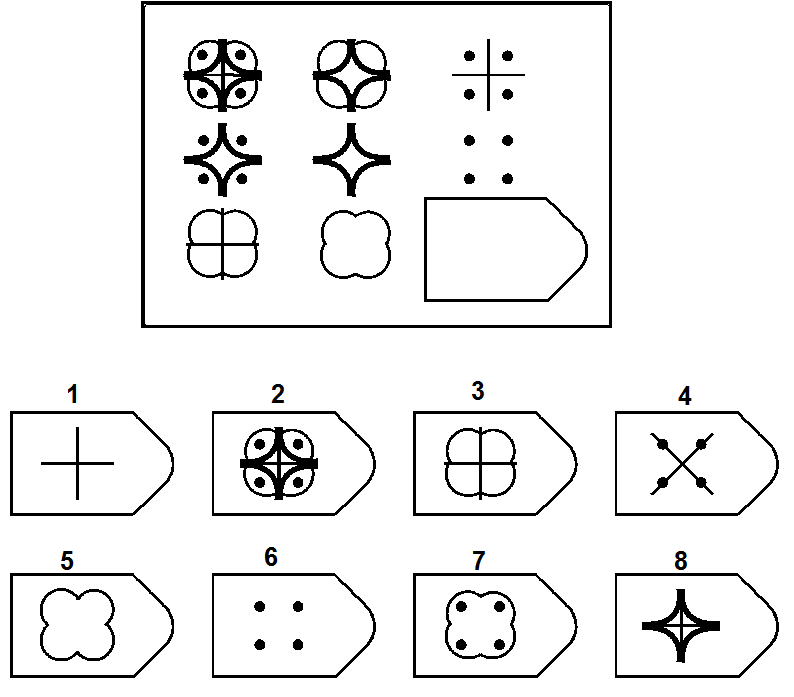
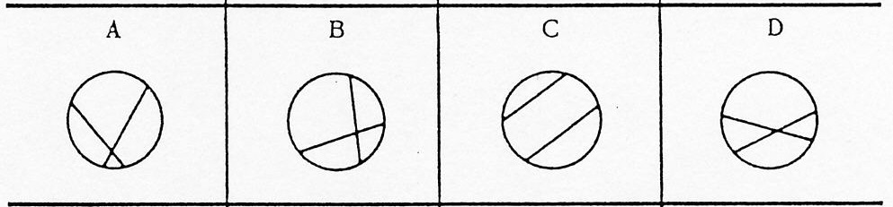

---
format:
  html:
    number-sections: false
bibliography: ../references.bib
suppress-bibliography: true
link-citations: true
include-in-header: figure/header.html
---

# Domande & Risposte {.unnumbered}

::: {.callout collapse="true"}
## Cos’è l’intelligenza?

> 🎯 Un'abilità mentale generale, ma è difficile da definire.

Non lo sappiamo con certezza. Potremmo definirla un’abilità mentale generale che ci permette di affrontare problemi e adattarci a situazioni anche molto diverse tra loro. Ma la natura di questa "abilità generale" è così sfuggente che Richard Haier la paragonò alla "materia oscura" del funzionamento mentale.

Nel corso di oltre un secolo le definizioni di intelligenza sono cambiate, seguendo l’evoluzione delle teorie psicologiche. Dopo la rivoluzione cognitiva degli anni ’50, ad esempio, le definizioni hanno iniziato a includere l'idea di rappresentazioni mentali e processi di elaborazione dell’informazione, insistendo sulla capacità di costruire modelli interni delle situazioni esterne per risolvere problemi mentalmente. Ciononostante, i test con cui si misura l’intelligenza sono rimasti, nella loro vera sostanza, molto simili a quelli dei primi del ’900 (come la batteria di Binet).

In una frase spesso citata, nel 1923 Edwin Boring scrisse che *“l’intelligenza è ciò che viene misurato dai test di intelligenza”*, aggiungendo che *“sarebbe stato meglio usare termini più tecnici”*. La circolarità della definizione rimanda al fatto che siamo più bravi a misurare l’intelligenza che a definirla teoricamente.

È interessante notare, però, che gli esseri umani sono molto sensibili all’intelligenza: anche i bambini sembrano intuirla. Un bambino potrebbe dire, per esempio, che è più intelligente chi risolve più problemi, chi conosce più parole, o chi impara più velocemente, cogliendo così, se non l’essenza dell’intelligenza, almeno alcune delle sue manifestazioni più rilevanti.
:::

::: {.callout collapse="true"}
## Come si misura l'intelligenza?

> 🎯 Sottoponendo tanti tipi di problemi diversi la cui soluzione richieda elaborazione/sforzo mentale.

Se ci si riferisce al QI, dunque all'abilità mentale generale, l'idea è che saper risolvere un problema non sia l'intelligenza in sé, ma un suo riflesso. L'importante è: 1) evitare compiti in cui una persona si sia già esercitata a lungo, perché l'obiettivo di solito è misurare un "potenziale" generale, non una competenza particolare già consolidata; 2) evitare di dipendere da un solo tipo di compito, poiché occasionalmente una persona potrebbe eccellere o difettare in capacità molto specifiche, senza che questo rifletta il suo potenziale. Pertanto, è meglio sottoporre tanti tipi di problemi diversi.

Ecco alcuni esempi di compiti simili a quelli usati dalle più diffuse batterie di intelligenza per misurare il QI:

| Tipo di compito | Esempio |
|:----------------------------|:------------------------------------------|
| Comprensione verbale / Somiglianze | In cosa sono simili *Ecosistema* e *Orchestra*? |
| Comprensione verbale / Vocabolario | Cosa significa la parola *"Licenzioso"*? |
| Memoria di lavoro fonologica | Ripeti al contrario la sequenza di cifre appena ascoltata:   “8 - 1 - 5 - 3 - 9 - 2” |
| Ragionamento fluido | Quale alternativa tra quelle sotto completa il riquadro?   {width="60%"} |
| Ragionamento fluido | Quale figura non va bene d'accordo con le altre?   {width="60%"} |
| Elaborazione visiva | Quale alternativa completa meglio la figura a sinistra?   {width="60%"} |
| Velocità di elaborazione / Barrage / Attenzione visiva | Barra il seguente bersaglio: ⬤ ◆ quante più volte possibile nella sequenza, hai solo un minuto.   *Sequenza*: ⬤ ◆ ◆ ◇ ■ ● ◇ ⬤ ● ◆ ◆ ⬤ ⬤ ■ ⬤ ■ ⬤ ◆ ◆ ◇ ● ◆ ◆ ⬤ ⬤ ◇ ■ ◆ ◇ ● ◆ ⬤ ◆ ◇ ◇ ◆ ● ■ ◆ ⬤ ◇ ◆ ⬤ ◆ ◆ ◇ ⬤ ■ ■ ● ◆ ⬤ ● ◆ ● ◆ ◇ ⬤ ■ ◆ ◆ ⬤ ● ◆ ◆ ◇ ◇ ■ ⬤ ◆ ◆ ⬤ ■ ● ◆ ◇ ⬤ ◆ ◆ ⬤ ● ■ ■ ◆ ◇ ◆ ◆ ◇ ⬤ ■ ◇ ● ● ◆ ● ■ ◆ ⬤ ◇ ◆ ◆ ◇ ⬤ ◆ ● ◆ ◇ ⬤ ■ ● ◆ ⬤ ⬤ ■ ◆ ⬤ ◇ ● ■ ◆ ... |
:::

::: {.callout collapse="true"}
## Si può essere intelligenti "in un modo solo" o "in tanti modi"?

> 🎯 Tende a prevalere "un modo solo".

Domanda molto dibattuta, e forse la risposta non piacerà. Dopo un secolo di studi, la ricerca psicometrica, genetica e neuroscientifica tende ad accettare l'esistenza e la preponderanza di un fattore generale di intelligenza (spesso indicato come *"fattore g"*). È il fattore che spiegherebbe perché le persone che ottengono buoni risultati in un tipo di test cognitivo tendono a ottenere buoni risultati anche in altri, apparentemente diversi tra loro (es. conoscenza del vocabolario, rotazione mentale di figure, velocità di esecuzione di compiti, memoria a breve termine, soluzione di problemi logici). L’idea risale addirittura all'inizio del Novecento, quando Charles Spearman osservò questa regolarità e ipotizzò che le prestazioni cognitive dovessero condividere una causa comune (*"generale"* appunto).

Il "fattore g", comunque, non è tutto. Oggi i modelli più accettati sono gerarchici (es. CHC): a fianco di un "fattore g" sovraordinato e centrale, riconoscono l'esistenza di aree di abilità specifiche. Solo considerando al tempo stesso l'abilità generale e le abilità specifiche possiamo descrivere adeguatamente l'intelligenza nel suo insieme. Tuttavia, g tende a essere predominante rispetto alle aree specifiche sia nel riassumere la prestazione ai test di intelligenza che a predire esiti rilevanti nella vita reale.

Alcuni studiosi, come Howard Gardner con la teoria delle intelligenze multiple, o Robert Sternberg con la teoria triarchica, hanno proposto visioni articolate secondo cui l’intelligenza si manifesta in modi distinti nella creatività, nel problem solving pratico, nelle competenze sociali, e in svariati domini di abilità in modi distinti. Tuttavia, queste prospettive, pur stimolanti e utili in ambito educativo, non hanno ricevuto un supporto empirico paragonabile a quello del fattore *g*.

Come rappresentante onesto ed esplicito del "mainstream" sullo studio dell'intelligenza ritengo che una concezione accurata debba ammettere la predominanza di un'abilità generale rispetto alle abilità specifiche. In altre parole, le persone sono possono essere intelligenti “in tanti modi”, ma questi modi tendono a essere, soprattutto, diverse espressioni di un’unica capacità generale di adattamento mentale.
:::

::: {.callout collapse="true"}
## È più importante “quanto sei intelligente” o “come sei intelligente”?

> 🎯 Tende a prevalere il "quanto".

Questa è una riformulazione della domanda precedente.

Il "quanto sei intelligente" può essere riassunto numericamente dal QI, mentre il "come" rimanda a un profilo di abilità particolari dove alcune potrebbero essere più forti e altre più deboli.

Come detto sopra, vanno considerati sia il "quanto" che il "come", ma a conti fatti il "quanto" (il "fattore g") predomina, per diversi motivi: spiega meglio la correlazione generale tra tante abilità apparentemente diverse, è il predittore migliore a lungo termine di esiti importanti nella vita reale, si osserva nei bambini fin da piccoli, e anche a livello pratico è una misura più stabile.
:::

::: {.callout collapse="true"}
## L’intelligenza si può davvero ridurre a un solo numero (QI)?

> 🎯 No, ma approssima abbastanza bene.

Il QI è calcolato da tutti i principali test di intelligenza, che sono tra le misure più usate ed efficaci nella pratica psicologica, e uno dei prodotti di maggiore "successo" della ricerca in psicologia.

Il QI, comunque, non dice tutto: a fianco a esso, molti test forniscono anche indici di abilità specifiche. Tuttavia, l'abilità generale (g) tende a prevalere rispetto a quelle specifiche. Cioè, è raro che un'abilità specifica sia fortemente sbilanciata rispetto a quella generale, e anche laddove ciò accade, è raro che l'abilità specifica "sbilanciata" abbia un forte impatto sulla vita reale. Ovviamente, esistono sempre le eccezioni, ma quello che guardiamo come prima cosa è il dato statistico complessivo. Per queste ragioni l'abilità generale (approssimata dal QI) si ritiene di solito una buona sintesi complessiva, e spesso è sufficiente.
:::

::: {.callout collapse="true"}
## Ma perché il QI è così importante?

> 🎯 Perché è predittivo di molte cose.

Perché in un'ora, anche meno, può fornire una stima che è molto predittiva del futuro potenziale di una persona: successo scolastico, prestazione lavorativa a parità di competenze "sulla carta", condizione socio-economica raggiunta a parità di condizioni di partenza, perfino longevità. Al tempo stesso, per le stesse ragioni, è anche predittiva del bisogno che una persona ha di ricevere aiuto e supporto. Fin dalle prime batterie di intelligenza, come la Binet-Simon, l'intento era soprattutto identificare casi di bisogno.

Detta in modo semplice, forse troppo semplice, tra tutti i "numeri" che possiamo avere sul funzionamento mentale di una persona, il QI è quello statisticamente più predittivo del maggior numero di cose diverse. Non lo è sempre, non lo è per tutti, non lo è in modo esclusivo, ma statisticamente lo è. Il QI è anche una misura molto stabile nel corso della vita (nel bene e nel male), soprattutto a partire dalla preadolescenza (circa 12 anni).
:::

::: {.callout collapse="true"}
## Il QI misura davvero “quanto sei intelligente” o “quanto sei diverso dalla media”?

> 🎯 Misura solo quanto sei diverso dalla media.

E qui scopriamo le carte. Il "quanto sei intelligente" in assoluto non è determinabile. Il QI misura solo quanto sei diverso/a dalla media. Tecnicamente, dice in quale punto della distribuzione dell'intelligenza generale ti trovi. Questa distribuzione si approssima bene con una "Gaussiana" (la famosa distribuzione "a campana", con poche persone in alto, poche in basso, e molte al centro).

Il "problema" è che il QI dice solo come la tua prestazione ai test di intelligenza si colloca rispetto a quella degli altri, e più precisamente rispetto alla media della tua popolazione di riferimento per lingua parlata, nazionalità ed età. Per essere ancora più chiari, è come se dicesse se, in una stanza con altre 100 persone, la tua prestazione mentale è la migliore, la peggiore, a metà, migliore o peggiore del 10%, del 20% delle altre persone presenti, e così via. Ad esempio, QI = 100 indica una prestazione esattamente "al centro" (in media) rispetto alla popolazione di riferimento (pari età, stessa lingua, stessa nazionalità).
:::

::: {.callout collapse="true"}
## Invecchiando si diventa più intelligenti o meno intelligenti?

> 🎯 Tendenzialmente "meno", ma conta molto il "come".

Invecchiando i processi cognitivi di base si indeboliscono, portando a un calo generale della prestazione mentale. Questo si può interpretare, in effetti, come una "diminuzione" dell'intelligenza, se per intelligenza intendiamo la capacità prestativa. È importante notare che il QI medio è sempre 100, a qualsiasi età, ma questo per definizione: definiamo QI = 100 la prestazione media... il problema è che all'aumentare dell'età la prestazione intellettiva media corrispondente a QI = 100 scende progressivamente.

Con l'età, però, cambia anche il "come" si è intelligenti:

-   la cosiddetta intelligenza "fluida", cioè la capacità di usare le risorse mentali per risolvere problemi nuovi, imprevisti, tendenzialmente astratti, rispetto ai quali non abbiamo un'esperienza acquisita, si indebolisce più fortemente con l'invecchiamento;
-   l'intelligenza "cristallizzata", cioè la capacità di fare leva su strategie, conoscenze, e abilità già acquisite, per risolvere situazioni e problemi simili a quelli già noti, e prevalentemente misurata attraverso compiti di tipo verbale, tende a resistere meglio all'invecchiamento, ed entro certi limiti può addirittura aumentare.
:::

::: {.callout collapse="true"}
## Intelligenti si nasce o si diventa?

> 🎯 In buona parte "si nasce", ma la risposta è molto complicata.

La domanda sarebbe: *"Conta più la genetica o l'ambiente/esperienza di vita?"* e la risposta è estremamente complicata e interseca molti piani di analisi.

Si potrebbe dire che se abbiamo un'intelligenza umana è perché abbiamo una genetica umana: da questo punto di vista sarebbe "tutta genetica". Ma la domanda non è così banale: di solito si vuole sapere se, statisticamente, la differenza di QI tra due persone rispecchi maggiormente la loro differenza genetica oppure la differenza nelle esperienze di vita che hanno fatto. Anche da questo punto di vista tende a prevalere la risposta "genetica": studi sui gemelli monozigoti e dizigoti suggeriscono che oltre il 50%, e forse anche oltre i due terzi della variabilità del QI rispecchi variabilità genetica. Quindi "si nasce" più che "si diventa" intelligenti.

La risposta, però, non è così semplice. Si potrebbe dire, infatti, che qualsiasi risposta sia contingente a un dato contesto sociale. Ad esempio, più le esperienze di vita sono omogenee in una società, senza grossi fattori ambientali di vantaggio o svantaggio che differiscono tra le persone (es. scolarizzazione universale, buona alimentazione garantita, buone opportunità economiche per tutte/i), più le basi genetiche potrebbero diventare preponderanti e anzi essere amplificate da un ambiente stimolante.

D'altro canto, però, l'ambiente/esperienza di vita può avere un effetto gigantesco che spesso passa "inosservato" per il modo in cui si misura il QI. L'effetto Flynn (vedi domanda sotto) ha mostrato che nel corso del Novecento c'è stato un incremento gigantesco nella capacità di prestazione intellettiva media di tutta la popolazione, senza che sia cambiata la genetica. Quindi, se è vero che la differenza di QI tra due persone dipende più dalla genetica che dalle loro esperienze di vita, questo è vero solo nel "qui e ora", cioè prendendo due persone nello stesso momento dalla stessa popolazione di riferimento.
:::

::: {.callout collapse="true"}
## Stiamo diventando più intelligenti o meno intelligenti?

> 🎯 Per tutto il Novecento la popolazione è diventata sempre più "intellettualmente performativa", ma ora, forse, questa crescita è finita.

Nel corso del Novecento, almeno nei paesi occidentali dove sono state fatte le rilevazioni, la popolazione è certamente diventata più "intellettualmente performativa". Questo effetto, noto come "effetto Flynn", è stato così gigantesco (in termini tecnici: +2 deviazioni standard) che oggi la prestazione intellettiva media (QI = 100) corrisponde a un livello di prestazione che all'inizio del Novecento era raggiunto solo da un'élite (2-3% di persone più capaci).

Si può discutere se questo rappresenti un vero aumento dell'intelligenza, ma di certo ha rispecchiato un aumento della capacità di usare l'intelletto. Le ragioni non sono genetiche, ma ambientali: in cento anni la genetica di una popolazione non cambia in modo apprezzabile, ma sono cambiate l'alimentazione, le condizioni igienico-sanitarie, la scolarizzazione, il tipo di lavoro svolto, e in generale l'ambiente sociale, culturale, ed economico è diventato più stimolante per lo sviluppo mentale. È interessante notare che a crescere più di tutto, più che le conoscenze generali legate a scolarizzazione e cultura, sia stata l'abilità di ragionare in termini astratti.

Oggi sembra però che questo effetto sia rallentato o addirittura scomparso, almeno nei paesi dove prima era stato rilevato, tra cui l'Italia. Nei paesi scandinavi (es. la Norvegia, dove il QI è regolarmente misurato a intere coorti di giovani sottoposti/e al servizio militare) sembra addirittura si stia andando verso un lieve declino. Forse la crescita era arrivata al "massimo" che poteva raggiungere, o forse oggi assistiamo a un genuino deterioramento della qualità degli "stimoli mentali". 
:::

::: {.callout collapse="true"}
## Possiamo aumentare la nostra intelligenza con i training, le parole crociate, la musica o i videogiochi?

> 🎯 In minima parte sì, ma non aspettiamoci miracoli.

È una domanda molto frequente: possiamo “allenare” l’intelligenza? La risposta breve è: dipende da cosa intendiamo per intelligenza e da quanto beneficio ci aspettiamo. Molte attività, come la musica, i videogiochi, gli esercizi mentali, o certi programmi di training cognitivo, possono certamente aiutare a migliorare le abilità specifiche che esercitano: memoria di lavoro, attenzione visiva, coordinazione, velocità di elaborazione, recupero di informazione verbale, ecc. Tuttavia, il trasferimento di questi vantaggi all’intelligenza generale (fattore g, approssimato dal QI) è molto limitato. In altre parole, si migliora nel tipo di compito che si pratica, ma la "generalizzazione" è minima o nulla [es. @melby-lervagWorkingMemoryTraining2016; @salaCognitiveAcademicBenefits2020].

Per esempio, alcune meta-analisi mostrano che i musicisti tendono ad avere, in media, un lieve vantaggio in alcuni test cognitivi [es. @talaminiMusiciansHaveBetter2017], ma non è chiaro se si tratti di un effetto causale (cioè generato dalla musica) o selettivo (cioè chi ha buone capacità cognitive è più portato a studiare musica e a perseverare, o viene da un ambiente generalmente più favorevole). E anche ammesso che sia causale, si parla di vantaggi modesti, che richiedono anni di pratica costante.

Il solo fenomeno che abbia prodotto aumenti davvero massicci del QI medio nella popolazione è stato l’effetto Flynn, ma questo è derivato da cambiamenti sociali giganteschi, come istruzione di massa, miglior nutrizione, migliore igiene, e una vita mentale, lavorativa, scolastica, sociale più astratta e complessa. Parliamo di circa 3 punti di QI per decennio, in media.

Detto questo, vale sempre la pena dedicarsi ad attività che stimolino la mente: musica, lettura, giochi di strategia, apprendimento continuo, se ci piacciono. Sono ottimi ingredienti per uno stile di vita mentalmente attivo, che è la cosa più importante per mantenere mente e cervello in salute, soprattutto con l’età. Ma lo stile di vita non dipende mai da un singolo fattore miracoloso: conta tutto l’insieme di abitudini, relazioni, curiosità, scelte e sforzi che definiscono ogni giorno della nostra vita.
:::

::: {.callout collapse="true"}
## Bambini/e con dislessia, ADHD o autismo sono “meno intelligenti”?

> 🎯 No, sono ugualmente intelligenti. Ma l'intelligenza può manifestarsi in modi leggermente diversi. 

Le condizioni del neurosviluppo, come la dislessia, l’ADHD o l’autismo, non implicano necessariamente un’intelligenza generale più bassa. Possono però modificare il modo in cui l’intelligenza si manifesta e viene osservata, tanto che, a un occhio inesperto, bambini o adulti con queste caratteristiche potrebbero sembrare “meno competenti” o “meno intelligenti” di quanto siano in realtà. Ad esempio, di solito la rapidità di apprendimento della lettura a scuola è una manifestazione di intelligenza, ma questo non è vero in chi abbia dislessia (un po' per definizione). 

In questi casi ciò che cambia non è il "quanto" ma il "come" si è intelligenti, facendo quindi eccezione alla regola generale. Bambini con disturbi specifici dell’apprendimento o dell'attenzione / iperattività (ADHD) possono in effetti ottenere punteggi di QI mediamente un po' più bassi nei test standardizzati, ma questo accade perché alcune prove, come quelle che richiedono memoria di lavoro verbale o attenzione sostenuta, sono influenzate da difficoltà molto specifiche, e non riflettono pienamente le capacità intellettive generali. In termini tecnici, si parla di un problema di *invarianza di misura*: il test non misura esattamente la stessa cosa in tutti i casi, perché per alcuni individui la prestazione è penalizzata da fattori non legati all’intelligenza vera e propria, ma da fattori specifici.

Per questo motivo, le principali linee guida internazionali raccomandano cautela nell’interpretare il QI in presenza di disturbi del neurosviluppo e suggeriscono di considerare anche altri indici o il profilo di punti di forza e debolezza nel loro insieme per stimare le reali potenzialità cognitive della persona. Queste condizioni ci ricordano che esiste sempre neurodiversità: le differenze nel funzionamento mentale non sono solo limiti, sono variazioni naturali del modo in cui il cervello elabora, impara, e si adatta, da persona a persona. Talvolta possono comportare difficoltà, ma anche punti di forza. L’intelligenza non è sempre un blocco monolitico: le condizioni del neurosviluppo sono (un po' per definizione) dei casi eccezionali.
:::

::: {.callout collapse="true"}
## È importante l’intelligenza emotiva? e l'intelligenza sociale?

> 🎯 Forse sì... ma forse non sono “intelligenze”: spesso sovrappongono tratti di personalità e abilità già note, e non dicono molto di più.

La capacità di capire e gestire le emozioni, proprie e altrui, è fondamentale per adattarsi, lavorare bene e mantenere relazioni sane. Tuttavia, nel mainstream della ricerca sull’intelligenza, “intelligenza emotiva” e “sociale” non sono considerate vere e proprie intelligenze distinte: molte misure si basano su questionari autoriportati ("self-report") più che su test "prestativi", e i loro punteggi si sovrappongono fortemente a tratti di personalità già noti (come stabilità emotiva o estroversione) e alle cosiddette soft skills (abilità acquisite di tipo interpersonale, di leadership, curiosità, ecc.). Sono quindi concettualizzate in modo separato rispetto alla classica "intelligenza"

Le meta-analisi mostrano che, una volta controllati in modo opportuno QI e i principali tratti di personalità, l’effetto aggiuntivo dell’intelligenza emotiva o sociale nel predire successo scolastico, lavorativo o benessere è modesto o nullo. In altre parole, catturano qualcosa di reale e utile, ma non aggiungono molto rispetto ai costrutti già noti.

In sintesi, “intelligenza emotiva” e “sociale” sono etichette che rimandano ad abilità importanti, ma forse è più corretto considerarle tratti, disposizioni, o al limite competenze comportamentali e relazionali (in quanto tali già studiate con successo nell'ambito della personalità e delle soft skills) piuttosto che forme nuove o diverse di intelligenza. Rappresentano, certo, il "come" usiamo la mente nelle interazioni umane, non un diverso "quanto" di intelligenza generale.
:::

::: {.callout collapse="true"}
## Un QI troppo alto (plusdotazione) è un problema?

> 🎯 No, in genere è un vantaggio. Ma...

Avere un QI elevato è generalmente un vantaggio: facilita l’apprendimento, la risoluzione di problemi complessi, l’adattamento e il successo accademico e professionale. Tuttavia, alcuni studi hanno suggerito che, oltre un certo punto, l’utilità aggiuntiva dell’intelligenza tenda a ridursi o annullarsi: avere “molta” intelligenza basta, averne “moltissima” non sempre aggiunge ulteriori benefici. Ovvero, se "molto è bene", non sempre "di più è meglio". Le ricerche su questo sono però inconsistenti e discordano molto su dove si trovi l’eventuale punto di discontinuità, se poco sopra la media o a livelli eccezionalmente alti (che sono difficili da studiare). Pertanto, non siamo ancora sicuri di cosa succeda davvero. 

Alcuni studi sui bambini con elevato QI segnalano possibili difficoltà di salute mentale, specialmente relativi ad adattamento e socializzazione. Il rischio, però, è che non si tratti di campioni rappresentativi: è più facile che arrivino all’attenzione psicologica i casi con problemi che non quelli sereni e ben integrati (che però magari sono la maggior parte). 

In linea di principio, tuttavia, è plausibile che avere un’intelligenza molto superiore alla media possa rendere più difficile trovare coetanei simili per interessi o stile di pensiero, e questo potrebbe creare un certo senso di distanza o isolamento. Immaginate di avere 8 anni, andare alla scuola elementare ogni giorno, e avere un'intelligenza da adolescente! Anche da adulti, avere QI altissimo può far sentire un po' isolati: la ricerca mostra che tendiamo a fare gruppo con persone simili a noi (per valori, personalità, caratteristiche fisiche, e anche per intelligenza): chi ha un QI molto alto farà, statisticamente, più fatica a trovare persone "simili".

In sintesi, l’intelligenza molto alta non è un problema in sé, ma una caratteristica rara che può avere vantaggi enormi e (forse) qualche sfida sociale. Come sempre, ciò che conta è l’insieme della persona: ambiente, interessi, relazioni, personalità, e la possibilità di esprimere il proprio potenziale nell'ambiente in cui si trova. 
:::
